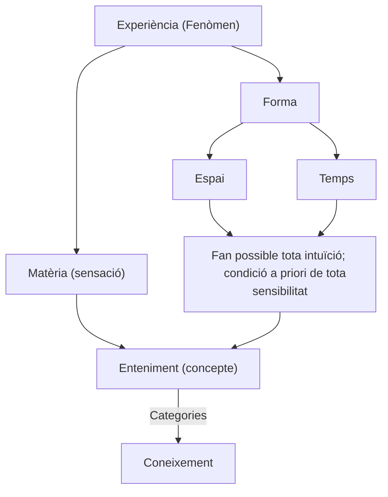

La filosofia de Kant és fonamentalment coneguda per la seva teoria del coneixement, que inclou les nocions de sensibilitat i enteniment. Aquestes dues facultats són claus en el seu sistema crític, particularment desenvolupat en la seva obra més important, la "Crítica de la raó pura".

### Sensibilitat

La sensibilitat (Sinnlichkeit) és la facultat a través de la qual rebem impressions o fenòmens del món exterior. Segons Kant, la sensibilitat és passiva; simplement rep dades del món exterior sense modificar-les. Aquestes dades es presenten a la ment com a intuïcions sensibles, que són necessàriament condicionades per dues formes a priori: l'espai i el temps. Això significa que qualsevol cosa que percebem sempre es percep dins d'un context espacial i temporal. 

### Enteniment

L'enteniment (Verstand), per altra banda, és la facultat activa que processa les dades rebudes per la sensibilitat. Mentre que la sensibilitat proporciona el contingut del coneixement, l'enteniment proporciona les formes o estructures mitjançant les quals aquest contingut és organitzat. L'enteniment ho fa mitjançant els conceptes purs o categories, que són idees a priori que estructuren les intuïcions sensibles en judicis. Les dotze categories inclouen, per exemple, les de causalitat, substància i unitat. Aquestes categories són necessàries per convertir les intuïcions sensibles en coneixement comprensible i coherent.

### Relació entre sensibilitat i enteniment

Kant sosté que el coneixement només és possible gràcies a la col·laboració entre sensibilitat i enteniment. Les intuïcions sensibles sense conceptes són cegues, i els conceptes sense intuïcions són buits. Això significa que per a conèixer qualsevol cosa, necessitem tant les dades brutes proporcionades per la sensibilitat com les estructures ordenadores proporcionades per l'enteniment.

```
    Coneixement === Judici
    << A és B >>

    on:
        A és una Intuïció (Fenòmen)
        B és un Concepte (Pensament de la unitat en la diversitat)
```

| Sensibilitat | Enteniment |
|-|-|
| · Passivitat (donat) | · Activitat (posat) |
| · Diversitat (intuïció) -> Sense el concepte és cega, contingut sense forma | · Unitat (concepte) -> Sense la intuïció és buit, forma sense contingut |
| · Intuïció (particular) | · Concepte (universal) |
| ► empíric (sensació) | ► empíric |
| ► pur (espai/temps) | ► sensible pur (matemàtics) |
|| ► a priori (categories) |

#### Coneixement



### Conceptes

A la filosofia de Kant, els conceptes es divideixen en diverses categories importants que ajuden a entendre com coneixem i comprenem el món. Aquí tens una breu descripció de cadascun dels conceptes que has mencionat:

1. **Conceptes Sensibles Purs (o intuïcions sensibles pures)**: Aquests són els elements bàsics de l'experiència sensorial, com la percepció de l'espai i el temps. Kant argumenta que l'espai i el temps no són propietats del món extern en sí mateix, sinó que són estructures subjectives que la ment imposa a la percepció sensorial per organitzar-la.

2. **Conceptes Empírics**: Són conceptes que s'adquireixen a través de l'experiència sensorial. Aquests conceptes es deriven de les nostres interaccions amb el món extern i estan lligats a experiències concretes. Per exemple, el concepte d'"arbre" es forma a partir de les nostres experiències amb arbres individuals.

3. **Conceptes A priori**: Aquests són conceptes que són independents de l'experiència empírica i s'apliquen universalment a tota experiència possible. Són condicions necessàries per a la possibilitat mateixa de l'experiència. Un exemple clàssic és el concepte de causalitat, que Kant argumenta que no es deriva de l'experiència, sinó que és una estructura bàsica de la ment que s'aplica a totes les nostres percepcions.

4. **Conceptes de la Raó**: Aquests conceptes són els principis generals i abstractes que la raó utilitza per organitzar i comprendre el coneixement. Exemples inclouen conceptes com l'infinit, l'absolut i el perfecte. Kant sosté que la raó tendeix a aplicar aquests conceptes més enllà dels límits de l'experiència, el que pot portar a paradoxes i antinòmies.

Kant argumenta que la combinació d'aquests tipus de conceptes és el que ens permet conèixer el món i tenir una comprensió coherent de la realitat. Els conceptes sensibles i empírics proporcionen el contingut concret de la nostra experiència, mentre que els conceptes a priori i de la raó proporcionen el marc conceptual dins del qual organitzem i comprenem aquesta experiència.

### Síntesi transcendental

Una de les idees centrals de Kant és la síntesi transcendental, que és el procés mitjançant el qual l'enteniment aplica les seves categories a les intuïcions sensibles per produir coneixement. Aquest procés implica la unificació de les dades disperses de la sensibilitat sota les regles de l'enteniment, creant així una experiència coherent del món.

Part del procés és separar allò que canvia i allò que romàn d'entre l'experiència.

### Fenòmens i noümens

Un altre aspecte important de la filosofia de Kant és la distinció entre fenòmens i noümens. Els fenòmens són les coses tal com les percebem, estructurades per la nostra sensibilitat i enteniment. Els noümens, en canvi, són les coses en si mateixes, independents de la nostra percepció. Kant argumenta que no podem tenir coneixement dels noümens perquè totes les nostres experiències estan mediades per les formes a priori de la sensibilitat i les categories de l'enteniment. Així, la nostra experiència està limitada al món fenomenal.

### Conclusió

La distinció kantiana entre sensibilitat i enteniment és fonamental per a la seva teoria del coneixement. La seva obra mostra com aquestes dues facultats, treballant conjuntament, permeten la formació de coneixements sobre el món, alhora que reconeix les limitacions inherents a la nostra capacitat de conèixer les coses en si mateixes. Kant va revolucionar la filosofia en explicar com el coneixement no només és una qüestió de rebre informació passivament, sinó també de com la nostra ment estructura activament aquesta informació.
